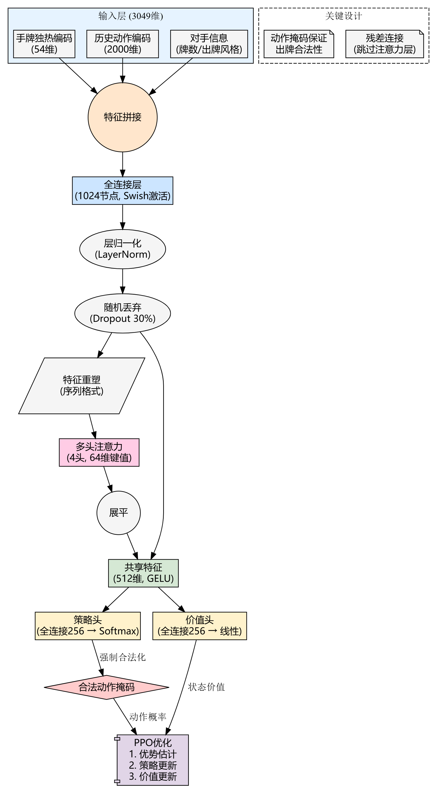

# 🎮 掼蛋强化学习 [在线试玩](https://guandan.streamlit.app/)


一个基于强化学习的掼蛋 AI 系统，支持 Actor-Critic（A2C）网络，具备训练与推理功能，使用自定义状态空间与奖励机制。

---

## 🚀 快速开始

### 1. 克隆项目

```bash
git clone https://github.com/746505972/guandan.git
cd guandan
```

### 2. 安装依赖

建议使用虚拟环境：

```bash
pip install -r requirements.txt
```

### 3. 运行训练/评估脚本

```bash
python actor.py  # 训练主循环
```

或打开 Streamlit 界面：

```bash
streamlit run app.py
```

---

## 🧠 强化学习设计说明

### ✅ A2C 网络结构（2025/4/25）

- **ActorNet**：输出结构动作 `action_id` 的概率分布（考虑了合法性 mask）。
- **CriticNet**：输出当前状态的 `value` 估计。

### 🎯 奖励函数

```python
r = reward + gamma ** (len(memory) - i - 1) * final_reward
```

- `reward`：即时奖励 = 出牌长度 × 牌型的 `logic_point`
- `final_reward`：整局奖励。队伍获胜时，等级为：12名→3，13名→2，14名→1，失败则为相反。
- `memory`：记录整局信息：
```python
  memory = [{state, action_id, reward}, ...]
 ```

### 🧮 优势函数（Advantage）

$$
\text{advantage} = r + \gamma \cdot V(s') - V(s)
$$

> 最后一个 `transition` 无 `s'`，设 $\gamma \cdot V(s') = 0$

- **Actor Loss**: $-\log(p) \cdot \text{advantage}$
- **Critic Loss**: $\text{advantage}^2$


---

## 🀄 状态编码（2025/4/20）

使用 One-Hot 或多热编码，构造状态维度如下：

| 特征             | 维度            | 描述                               |
|------------------|------------------|------------------------------------|
| 当前玩家的手牌     | 108              | 两副牌的 54 张牌的是否在手信息         |
| 其他玩家手牌数量    | 3                | 剩余牌数（归一化）                     |
| 每个玩家最近动作    | 108 × 4          | 上轮每位玩家的出牌                     |
| 出过的牌          | 108 × 3          | 记录其他玩家已经打出的牌                |
| 当前级牌         | 13               | One-hot 编码                         |
| 最近 20 次动作    | 108 × 4 × 5      | 5 轮历史，每轮 4 玩家，每人 108 维       |
| 协作状态         | 3                | 与队友协作的程度                      |
| 压制状态         | 3                | 对敌方的打击程度                      |
| 辅助状态         | 3                | 是否有意铺路（辅助队友）               |
| **总维度**        | `3049`           | 完整输入维度                         |

### 🃏 示例手牌编码：

```python
hand = ['红桃2', '红桃2','黑桃3', '红桃3', '黑桃4', '红桃4', '红桃4', '黑桃4',
        '黑桃5', '红桃5','大王','小王','大王']
```

其编码如下：

```
[0. 1. 1. 1. 0. 0. 0. 0. 0. 0. 0. 0. 0. 1. 1. 1. 1. 0. 0. 0. 0. 0. 0. 0. 0. 0. 0. 0. 0. 0. 0. 0. 0. 0. 0. 0. 0. 0. 0. 0. 0. 0. 0. 0. 0. 0. 0. 0. 0. 0. 0. 0. 0. 0. 1. 0. 0. 0. 0. 0. 0. 0. 0. 0. 0. 1. 0. 1. 0. 0. 0. 0. 0. 0. 0. 0. 0. 0. 0. 0. 0. 0. 0. 0. 0. 0. 0. 0. 0. 0. 0. 0. 0. 0. 0. 0. 0. 0. 0. 0. 0. 0. 0. 0. 1. 1. 0. 1.]
```

---

## 📊 项目结构简要说明

- `actor.py`: 训练主脚本，包含 Actor/Critic 网络结构
- `app.py`: Streamlit 可视化前端
- `test.py`: Streamlit 可视化后端
- `display.py`: 控制台可视化前后端&胜率计算
- `give_cards.py`、`rule.py`: 工具函数、规则逻辑
- `doudizhu_actions.json`: 结构化动作空间
- `setup.py`: Cython编译文件
- `model/`: 存放模型结构
- `server/`: 联机模式数据存放后端


---

## 📌 TODO

- [ ] 实现 PPO 算法训练
- [ ] 联机对战支持（房间制）
- [ ] 更丰富的可视化界面与对战记录

---

## 📄 License

本项目遵循 [MIT License](https://github.com/746505972/guandan/blob/main/LICENSE)
